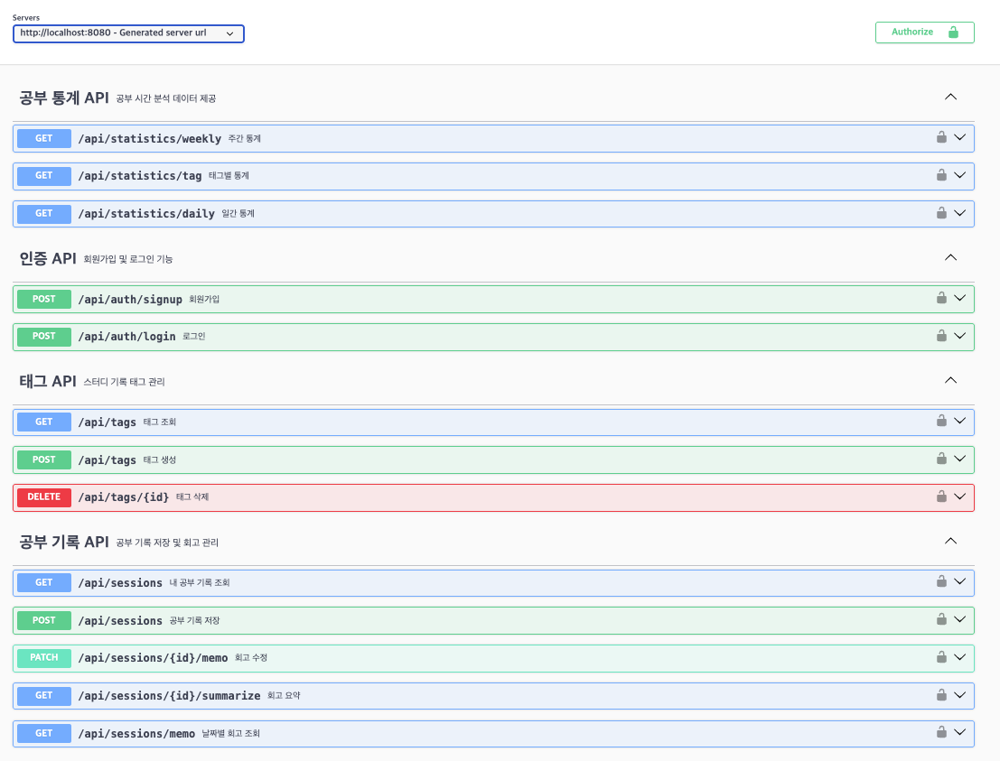

# 📘 StudyMate - 스터디 분석 플랫폼

> 사용자별 공부 기록을 분석하고 시각화하여 **자기 주도 학습을 돕는 백엔드 중심 프로젝트** 입니다.


---

## 🔧 기술 스택

| 구분       | 내용                          |
|------------|-------------------------------|
| Language   | Java 17                       |
| Framework  | Spring Boot 3.4.5             |
| ORM        | JPA (Hibernate)               |
| Database   | MySQL                         |
| Auth       | Spring Security + JWT         |
| Docs       | Swagger 3 (springdoc-openapi) |
| Test       | JUnit5, MockMvc, SpringBootTest |
| 기타       | OpenAI API, Git Submodule 관리 |

---

## 🧠 주요 기능

### ✅ 사용자 인증
- JWT 기반 무상태 인증 구현으로 확장성과 보안성 강화
- BCryptPasswordEncoder로 비밀번호 안전하게 암호화
- 로그인 시 JWT 토큰 발급, API 호출 시 토큰 검증으로 권한 확인

### 📚 공부 기록 관리
- 시작/종료 시간, 태그, 회고 메모를 포함한 상세 기록 저장
- 날짜별 회고 메모 조회 및 수정 기능 제공
- OpenAI API 연동으로 회고 자동 요약 기능 구현 (AI 활용)

### 🏷️ 태그 관리
- 사용자별 태그 생성, 조회, 삭제 기능 제공
- 공부 기록에 태그 연동, 통계 분석 시 분류 기준 활용

### 📊 통계 분석
- 일간: 24시간 기준 분 단위 공부 시간 분석
- 주간: 월~일 고정 요일별 총 공부 시간 집계
- 태그별: 태그별 누적 공부 시간 산출로 관심 분야 파악 지원

---

## 🛡 예외 및 응답 처리

### ✅ 공통 응답 구조
```json
{
  "success": true,
  "data": ...,
  "message": "요청 성공"
}
```
---
## 🔄 기능 흐름 요약

1. 회원가입 → 로그인 → JWT 발급
2. 태그 생성 → 공부기록 생성 시 태그 선택
3. 공부기록 저장 → 메모 입력 → 회고 요약 요청
4. 통계 API로 일간/주간/태그별 공부량 조회
---
## 📄 API 명세서

- Swagger UI: [http://localhost:8080/swagger-ui/index.html](http://localhost:8080/swagger-ui/index.html)
- 인증 시 `Bearer {JWT_TOKEN}` 형식으로 토큰 삽입!
 